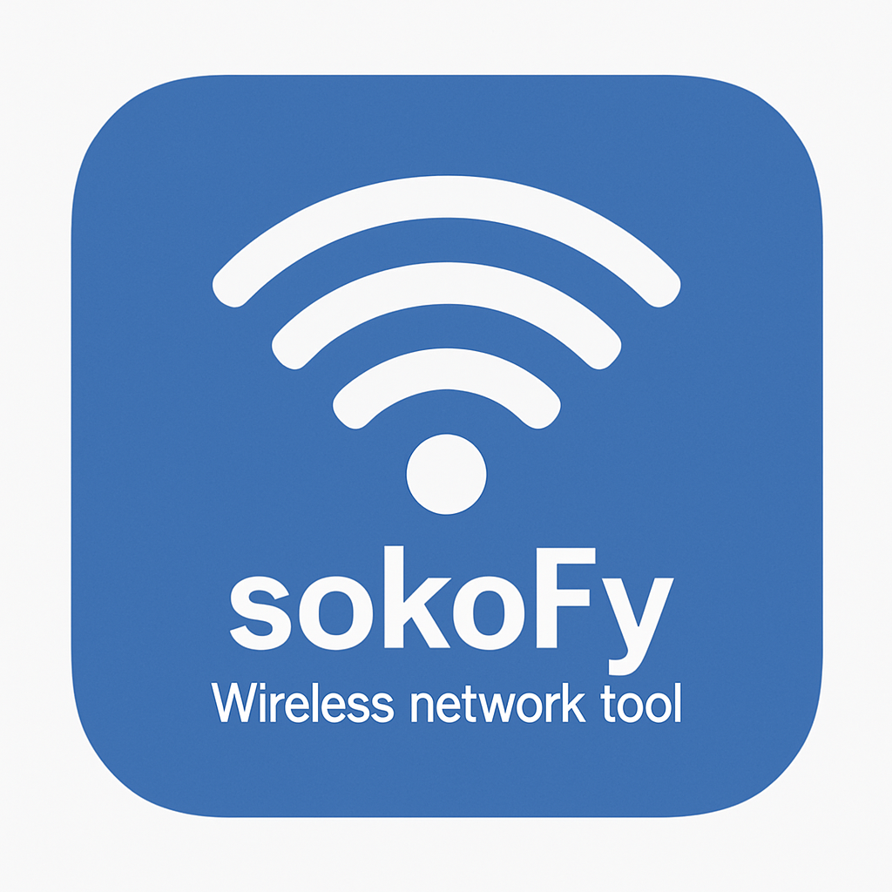

# sokoFy

  

###### Wi-Fi 4-Way Handshake Simulator  

## About
Is a lightweight educational simulator that visually demonstrates the WPA2 Wi-Fi 4-way handshake process. Designed for cybersecurity and networking students, it helps you understand how authentication and key exchange work between a client (STA) and an access point (AP) in a secure wireless network.

## Table of Content
- [Dependencies](#Dependencies)
- [Installation](#Installation)
- [Usage](#Usage)

## Dependencies
**NOTE:** Keep all the files in the same folder sokoFy-windows for it to execute without any issues, failure to that you will need to install the dependancies on your machine, that includes;
1. `libgcc_s_seh-1.dll`
2. `libstdc++-6.dll`
3. `libwinpthread-1.dll`

## Installation
### Windows
1. Click on **Code** → **Download ZIP**
2. Go to your downloads and unzip **sokoFy-main.zip**
3. Open the unzipped folder, change the directory to **sokoFy-windows** and double click on **sokoFy.exe**
4. Enjoy!!!

## Usage
